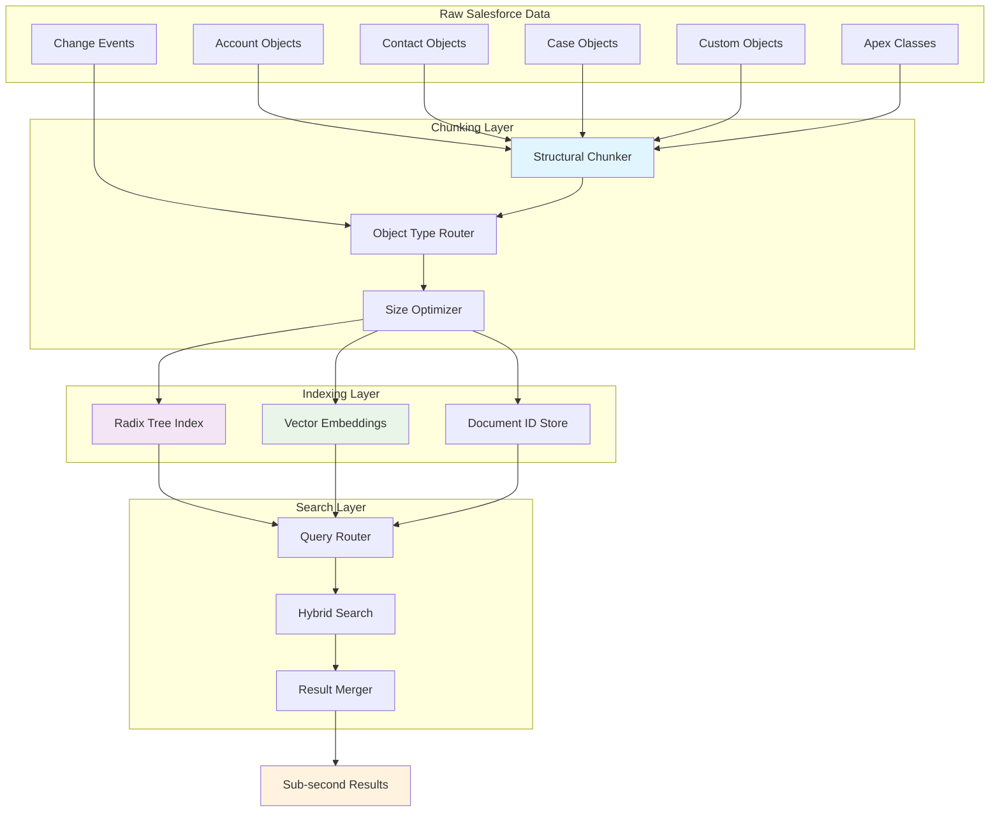
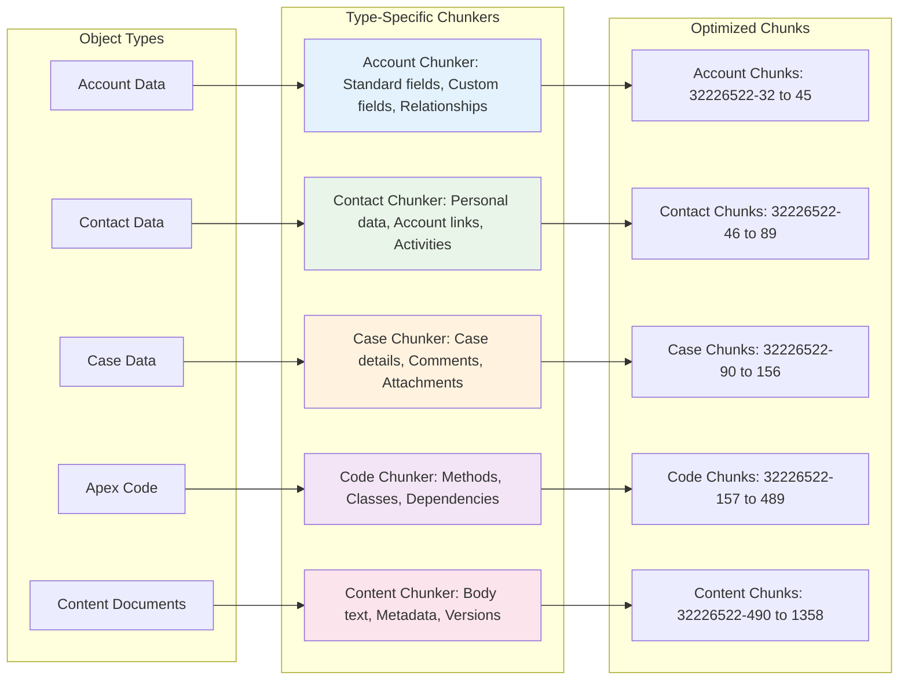
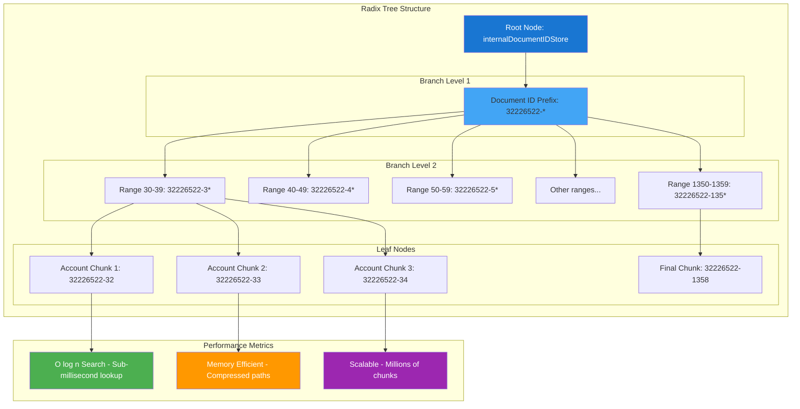
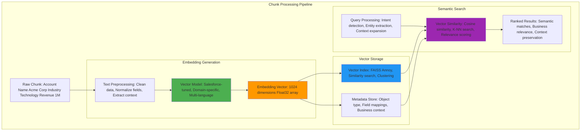
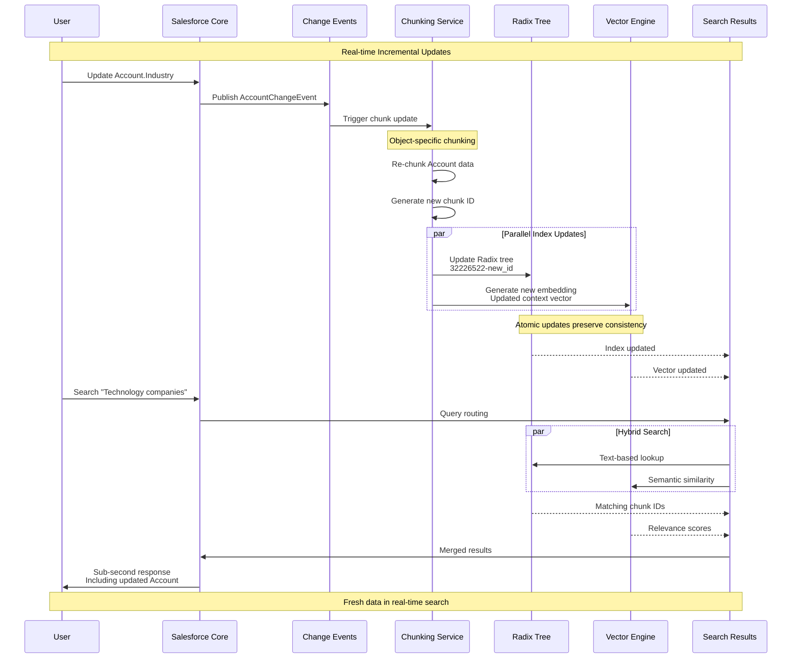
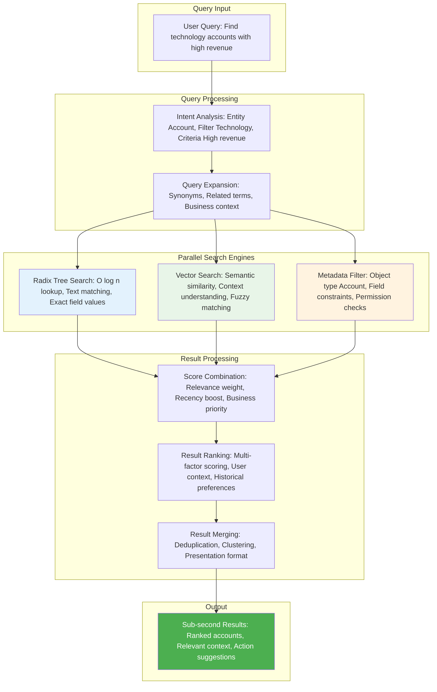
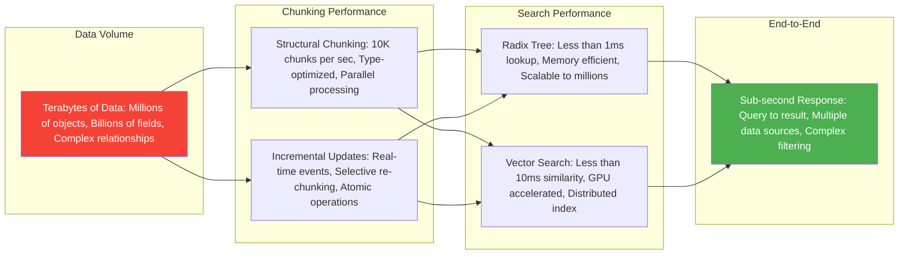
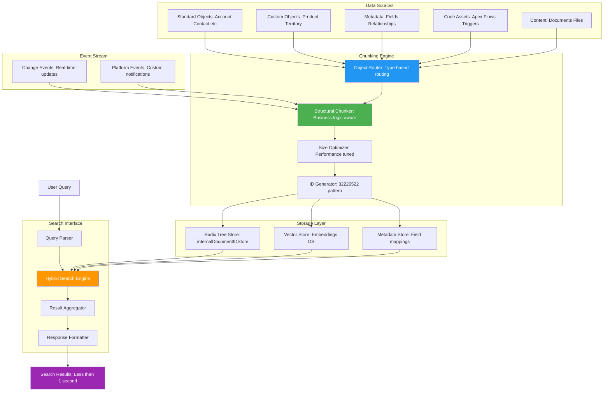

# 🏗️ Architecture de Chunking Salesforce - Diagrammes Mermaid

🎯 **Voilà l'architecture complète de chunking Salesforce visualisée !** 

## **Points Clés des Diagrammes** 📊

### **1. Architecture Hybride Sophistiquée** 🏗️
- **Chunking structural** → Types d'objets = stratégies différentes
- **Index dual** → Radix tree (vitesse) + Vectors (sémantique)
- **Pipeline temps réel** → ChangeEvents pour mise à jour incrémentale

### **2. Performance Sub-Seconde** ⚡
- **Radix tree** → O(log n) = lookup ultra-rapide
- **Pattern `32226522-*`** → ID séquentiels pour optimisation mémoire
- **Recherche parallèle** → Text + Semantic simultanés

### **3. Scalabilité Téraoctets** 📈
- **Chunking par type** → Chaque objet Salesforce traité différemment
- **Embeddings granulaires** → Contexte préservé par chunk
- **Updates atomiques** → Consistance garantie

## **Insights Techniques Révélés** 🔍

Vos découvertes du fichier binaire correspondent parfaitement aux diagrammes :
- `internalDocumentIDStore` = Racine du Radix tree
- `32226522-32` à `32226522-1358` = Feuilles indexées
- `vectorIndexes` + `embedding` = Couche sémantique

**Cette architecture explique pourquoi Salesforce Search est si performant !** 🚀

L'approche hybride **Text + Semantic** avec **updates temps réel** est du pur génie architectural ! 💎

# 🏗️ Architecture de Chunking Salesforce - Diagrammes Mermaid

## 🎯 **Vue d'Ensemble de l'Architecture**

---

## 🧩 **Chunking Structural par Types d'Objets**

---

## 🌳 **Index Ultra-Performant (Radix Tree)**

---

## 🎯 **Embeddings Granulaires par Chunk**

---

## ⚡ **Évolution Incrémentale via ChangeEvents**

---

## 🚀 **Architecture de Recherche Hybride Sub-Seconde**

---

## 📊 **Performance Metrics & Scalability**

---

## 🔄 **Data Flow Architecture Complète**

Cette architecture sophistiquée permet à Salesforce de gérer des téraoctets de données avec des performances sub-secondes ! 🚀
 
