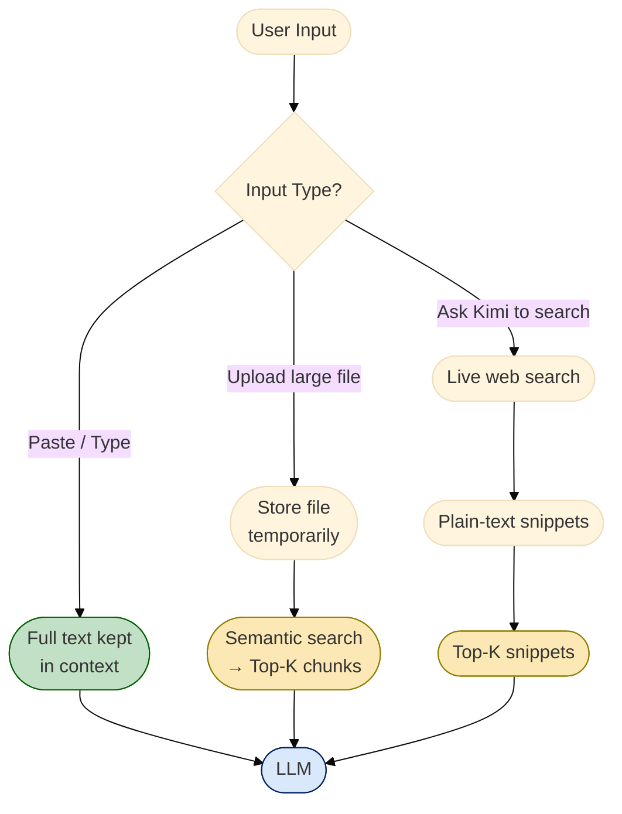

```mermaid

%%{init:{'theme':'base'}}%%
flowchart TD
    A([User Input]) --> B{Input Type?}

    %% 1. Pasted / short text
    B -->|Paste / Type| C1([Full text kept<br>in context])
    C1 --> Z([LLM])

    %% 2. Uploaded large file
    B -->|Upload large file| D1([Store file<br>temporarily])
    D1 --> D2([Semantic search<br>→ Top-K chunks])
    D2 --> Z

    %% 3. Kimi external search
    B -->|Ask Kimi to search| E1([Live web search])
    E1 --> E2([Plain-text snippets])
    E2 --> E3([Top-K snippets])
    E3 --> Z

    %% Styling
    classDef green fill:#c2e0c6,stroke:#006100
    classDef yellow fill:#fce8b4,stroke:#8f7f00
    classDef blue  fill:#dae8fc,stroke:#002060
    class C1 green
    class D2,E3 yellow
    class Z blue
```
