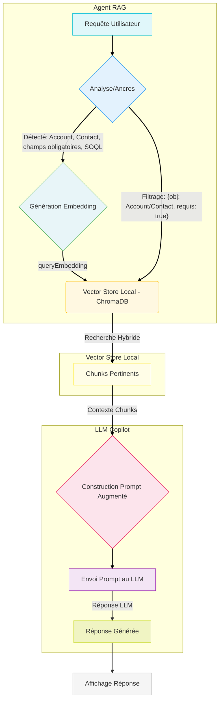

-----

Absolument \! Voici un diagramme Mermaid qui illustre le flux de traitement de la requête "utiliser les champs obligatoires des objets Account et Contact et créer une requête SOQL de requêtage", en augmentant le contexte depuis un RAG de métadonnées avant d'utiliser le LLM de GitHub Copilot dans VS Code.

Ce diagramme met en évidence la synergie entre la détection d'ancres (objets `Account`, `Contact`), la récupération structurée, la recherche sémantique et l'augmentation du prompt pour le LLM.

-----

### Explication Détaillée du Flux :

1.  **Utilisateur (A)** : Le développeur soumet sa requête en langage naturel via l'interface de votre extension VS Code.

2.  **Analyse de la Requête / Détection d'Ancres (B)** :

      * Votre extension VS Code intercepte la requête.
      * Elle effectue une analyse initiale (prétraitement non-sémantique) pour détecter les "ancres" spécifiques :
          * Noms d'objets Salesforce (ex: `Account`, `Contact`).
          * Mots-clés indiquant des propriétés spécifiques de champs (ex: "obligatoire", "custom", "listes de sélection", "devise").
          * Le type de résultat souhaité (ex: "requête SOQL").
      * Cette étape est cruciale pour guider la recherche RAG de manière précise.

3.  **Génération d'Embedding de la Requête (C)** :

      * La requête utilisateur complète (ou une version reformulée par l'agent) est envoyée à un **modèle d'embedding local** (par exemple, via `@huggingface/transformers` en Wasm).
      * Ce modèle génère le **`queryEmbedding`** (le vecteur numérique) représentant le sens sémantique de la question.

4.  **Vector Store Local - ChromaDB (D)** :

      * Votre extension envoie le `queryEmbedding` à votre instance **ChromaDB locale**.
      * **Le point clé ici est la `Recherche Hybride`** : ChromaDB utilise non seulement le `queryEmbedding` pour la recherche de similarité sémantique, mais aussi les **filtres `where`** basés sur les ancres détectées à l'étape (B).
          * Par exemple, `where: {object_api_name: "Account" OU "Contact", is_required: true}` filtre d'abord les chunks pour ne considérer que ceux qui correspondent aux objets spécifiés et qui sont marqués comme obligatoires dans vos métadonnées stockées. La recherche sémantique s'applique ensuite sur ce sous-ensemble déjà pertinent.

5.  **Chunks de Métadonnées Pertinentes (E)** :

      * ChromaDB retourne les **chunks de texte les plus pertinents** (par exemple, les descriptions des champs `Name`, `Phone`, `Website` d'Account si obligatoires, ou `LastName`, `Email` de Contact). Ces chunks incluent les métadonnées originales (noms API, types, descriptions, etc.).

6.  **Construction du Prompt Augmenté (F)** :

      * Votre extension prend la question originale de l'utilisateur et les chunks de métadonnées récupérés.
      * Elle construit un **prompt détaillé** pour le LLM, intégrant ces informations comme contexte. Ce prompt guide le LLM pour qu'il utilise les métadonnées fournies pour générer la requête SOQL spécifique.

7.  **Envoi du Prompt au LLM de Copilot (G)** :

      * L'extension utilise l'API de GitHub Copilot (par exemple, `vscode.commands.executeCommand('github.copilot.chat.sendRequest', ...)` ou une interface `ChatAgent`) pour envoyer le prompt augmenté au LLM de Copilot.

8.  **Réponse Générée (H)** :

      * Le LLM de Copilot, maintenant enrichi par le contexte précis de vos métadonnées Salesforce, génère la requête SOQL demandée, incluant les champs obligatoires identifiés pour Account et Contact.

9.  **Affichage de la Réponse à l'Utilisateur (I)** :

      * La réponse du LLM est affichée à l'utilisateur dans l'interface de VS Code, directement là où le développeur en a besoin.

Ce diagramme illustre clairement comment votre extension agit comme un **orchestrateur RAG intelligent**, combinant la force des ancres contextuelles avec la puissance de la recherche sémantique pour fournir des réponses ultra-pertinentes via un LLM tiers comme GitHub Copilot.
